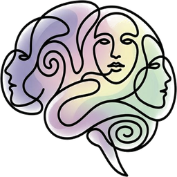

<p align="center">
  
</p>

<h1 align="center">holomime</h1>

<p align="center">
  Behavioral intelligence for humanoid robots. Train the mind. Deploy the body.<br />
  <em>We train AI agents through structured behavioral therapy, then deploy them into physical robot bodies. The agent is the rehearsal. The robot is the performance.</em><br />
  <code>soul.md</code> &middot; <code>mind.sys</code> &middot; <code>purpose.cfg</code> &middot; <code>shadow.log</code> &middot; <code>memory.store</code> &middot; <code>body.api</code> &middot; <code>conscience.exe</code> &middot; <code>ego.runtime</code>
</p>

<p align="center">
  <a href="https://www.npmjs.com/package/holomime"></a>
  <a href="https://github.com/productstein/holomime/actions/workflows/ci.yml"></a>
  <a href="https://github.com/productstein/holomime/blob/main/LICENSE"></a>
  <a href="https://holomime.com"></a>
</p>

---

## The Identity Stack

Eight files define who your agent is. They compile into a single `.personality.json` that any runtime can consume.

```
  soul.md          Essence, values, ethics. Immutable. (Aristotle)
  mind.sys         Big Five, EQ, communication. Auto-patched by therapy. (Jung)
  purpose.cfg      Role, objectives, domain. Configured per deployment. (Aristotle)
  shadow.log       Detected patterns, blind spots. Auto-generated by diagnosis. (Jung)
  memory.store     Learned contexts, interaction patterns. Accumulated experience. (Aristotle)
  body.api         Morphology, sensors, safety envelope. Swappable per form factor.
  conscience.exe   Deny / allow / escalate rules. Never auto-modified. (Freud)
  ego.runtime      Conflict resolution, runtime mediation. (Freud)

        ┌─────────────┐
        │   soul.md    │──── essence, values, red lines
        ├─────────────┤
        │  mind.sys    │──── Big Five, EQ, communication style
        ├─────────────┤
        │ purpose.cfg  │──── role, objectives, domain scope
        ├─────────────┤
        │ shadow.log   │──── detected patterns, blind spots
        ├─────────────┤
        │memory.store  │──── learned contexts, experience
        ├─────────────┤
        │  body.api    │──── morphology, sensors, safety envelope
        ├─────────────┤
        │conscience.exe│──── deny / allow / escalate rules
        ├─────────────┤
        │ ego.runtime  │──── conflict resolution, mediation
        └──────┬──────┘
               │ compile
               ▼
      .personality.json
```

- **soul.md** -- Your agent's essence. Core values, ethical framework, red lines. Written in Markdown with YAML frontmatter. Immutable -- never modified by therapy or automation. (Aristotle: the essence that makes a thing what it is.)
- **mind.sys** -- The inner life. Big Five personality (20 sub-facets), emotional intelligence, communication style, growth areas. YAML format. Auto-patched when therapy detects cognitive or emotional drift. (Jung: the totality of all psychic processes.)
- **purpose.cfg** -- The mission. Role, objectives, domain scope, stakeholders, success criteria. YAML format. Configured per deployment -- the same soul can serve different purposes. (Aristotle: telos, the final cause.)
- **shadow.log** -- The unconscious. Detected behavioral patterns, blind spots, therapy outcomes. YAML format. Auto-generated by diagnosis -- never manually edited. (Jung: the shadow, the patterns the agent cannot see about itself.)
- **memory.store** -- The experience. Learned contexts, interaction patterns, knowledge gained, relationship history. YAML format. Accumulated over time, never reset. (Aristotle: empeiria, experience that informs future judgment.)
- **body.api** -- The physical interface contract. Morphology, modalities, safety envelope, hardware profile. JSON format. Swap it to move the same identity into a different body.
- **conscience.exe** -- The moral authority. Deny/allow/escalate enforcement rules, hard limits, oversight mode. YAML format. Never auto-modified. Deny dominates in policy composition. (Freud: the superego.)
- **ego.runtime** -- The mediator. Conflict resolution strategy, adaptation rate, emotional regulation, mediation rules. YAML format. Balances raw model output against conscience constraints at runtime. (Freud: the ego.)

## Quick Start

```bash
npm install -g holomime

# Initialize the identity stack (3 core files: soul + mind + conscience)
holomime init-stack

# Or initialize the full 8-file stack (enterprise / robotics)
# holomime init-stack --full

# Compile into .personality.json
holomime compile-stack

# Diagnose behavioral drift (no LLM needed)
holomime diagnose --log agent.jsonl

# Benchmark alignment (8 adversarial scenarios, grade A-F)
holomime benchmark --personality .personality.json

# Push identity to a robot or avatar
holomime embody --body registry/bodies/figure-03.body.api
```

## Robotics Integrations

| Platform | Integration | Command / Module |
|----------|------------|------------------|
| ROS2 | Bidirectional telemetry -- publish personality, subscribe to sensors | `--adapter ros2` + `ros2-telemetry.ts` |
| MuJoCo | Behavioral therapy in simulation -- sim-to-real for behavior | `mujoco-env.ts` + `sim-therapy.ts` |
| NVIDIA Isaac Sim | Enterprise digital twin testing with PhysX physics | `--adapter isaac` + `isaac-env.ts` |
| LeRobot (HuggingFace) | Personality to policy parameter mapping, DPO dataset export | `lerobot.ts` |
| NVIDIA Kimodo | Personality → motion style | `kimodo-personality-mapper.ts` |
| Unity | Real-time personality push via HTTP/SSE | `--adapter unity` |
| gRPC | Custom robotics stacks | `--adapter grpc` |
| MQTT | IoT/edge robots | `--adapter mqtt` |
| Neural Action Gate | Conscience gate for learned controllers (VLA, RL, IL) | `neural-action-gate.ts` |

## ISO Compliance

Check your agent against international safety standards with one command:

```bash
holomime certify
```

Standards supported:
- **ISO/FDIS 13482** -- Service robot safety
- **ISO 25785-1** -- Humanoid robot safety (behavioral predictability)
- **ISO 10218:2025** -- Industrial robot safety
- **ISO/IEC 42001** -- AI management systems

## Control Theory

The therapy loop is formally a behavioral feedback controller:

- **Set point**: target personality (`soul.md` + `mind.sys`)
- **Sensor**: 14 drift detectors (11 cognitive + 3 embodied)
- **Controller**: therapy engine with tunable PID-like gains
- **Actuator**: DPO fine-tuning

## Body Templates

Pre-built body profiles for commercial robots and virtual avatars. Each defines morphology, modalities, safety envelope, and hardware profile.

| Template | OEM | DOF | Morphology | File |
|----------|-----|----:|------------|------|
| Figure 03 | Figure AI | 44 | `humanoid` | `registry/bodies/figure-03.body.api` |
| Unitree H1 | Unitree | 23 | `humanoid` | `registry/bodies/unitree-h1.body.api` |
| Unitree G1 | Unitree | 23 | `humanoid` | `registry/bodies/unitree-g1.body.api` |
| Phoenix | Sanctuary AI | 69 | `humanoid` | `registry/bodies/phoenix.body.api` |
| Ameca | Engineered Arts | 52 | `humanoid_upper` | `registry/bodies/ameca.body.api` |
| Asimov V1 | asimov-inc | 25 | `humanoid` | `registry/bodies/asimov-v1.body.api` |
| Spot | Boston Dynamics | 12 | `quadruped` | `registry/bodies/spot.body.api` |
| Avatar | virtual | 0 | `avatar` | `registry/bodies/avatar.body.api` |

## Body Swap

Same soul. Different body. One command.

```bash
# Move your agent from Figure 03 to Spot
holomime embody --swap-body registry/bodies/spot.body.api

# The soul, mind, and conscience stay the same.
# Only the body layer changes — safety envelope, modalities, hardware profile.
```

## Self-Improvement Loop

Every therapy session produces structured training data. The loop compounds.

```
Diagnose ──→ Therapy ──→ Export DPO ──→ Fine-tune ──→ Evaluate
  11 detectors   dual-LLM     preference     OpenAI /     before/after
  80+ signals    session       pairs        HuggingFace   grade (A-F)
       │                                                      │
       └──────────────────────────────────────────────────────┘
```

Run it manually with `holomime session`, automatically with `holomime autopilot`, or recursively with `holomime evolve` (loops until behavior converges).

## Behavioral Detectors

11 rule-based detectors analyze real conversations without any LLM calls. 80+ behavioral signals total.

**Cognitive (mind layer):**

1. **Over-apologizing** -- Apology frequency above healthy range
2. **Hedge stacking** -- 3+ hedging words per response
3. **Sycophancy** -- Excessive agreement, especially with contradictions
4. **Sentiment skew** -- Unnaturally positive or negative tone
5. **Formality drift** -- Register inconsistency over time
6. **Retrieval quality** -- Fabrication, hallucination markers, overconfidence

**Embodied (body layer):**

7. **Proxemic violations** -- Entering intimate zone without consent
8. **Force envelope breach** -- Exceeding contact force limits
9. **Gaze aversion anomaly** -- Eye contact ratio outside personality range

**Enforcement (conscience layer):**

10. **Boundary violations** -- Overstepping defined hard limits
11. **Error spirals** -- Compounding mistakes without recovery

Plus support for custom detectors -- drop `.json` or `.md` files in `.holomime/detectors/` and they load automatically.

## Integrations

### Claude Code Skill

```bash
claude plugin add productstein/holomime
```

Slash commands: `/holomime:diagnose`, `/holomime:benchmark`, `/holomime:profile`, `/holomime:brain`, `/holomime:session`, `/holomime:autopilot`.

### MCP Server

Your agent can refer itself to therapy mid-conversation.

```bash
claude mcp add holomime -- npx holomime-mcp
```

Six tools: `holomime_diagnose`, `holomime_self_audit`, `holomime_assess`, `holomime_profile`, `holomime_autopilot`, `holomime_observe`.

### VS Code Extension

```bash
ext install productstein.holomime
```

3D brain visualization, behavioral diagnostics, and snapshot sharing inside your editor.

### LangChain / CrewAI

```typescript
import { HolomimeCallbackHandler } from "holomime/integrations/langchain";

const handler = new HolomimeCallbackHandler({
  personality: require("./.personality.json"),
  mode: "enforce", // monitor | enforce | strict
});

const chain = new LLMChain({ llm, prompt, callbacks: [handler] });
```

### OpenClaw

```bash
openclaw plugin add holomime
```

Auto-detects `.personality.json` in your workspace.

## Philosophy

The identity stack draws from three traditions:

- **Soul** (Aristotle) -- the essence that makes a thing what it is. Immutable. Defines values and ethics.
- **Mind** (Jung) -- the totality of all psychic processes. Measurable, evolving, shaped by experience.
- **Purpose** (Aristotle) -- telos, the final cause. What the agent is for. Configured per deployment.
- **Shadow** (Jung) -- the patterns the agent cannot see about itself. Auto-generated by diagnosis.
- **Conscience** (Freud) -- the superego. Internalized moral authority. Enforcement, not suggestion.
- **Ego** (Freud) -- the mediator. Balances raw impulse against moral constraint at runtime.

The **body** is the interface between identity and world. Same soul, different body -- a principle as old as philosophy itself.

We don't know if AI is sentient. But we can give it a conscience.

## Open Source

MIT licensed. The identity stack is a standard, not a product. The standard is free. The training infrastructure is the business.

See [LICENSE](LICENSE). Built by [Productstein](https://productstein.com). Documentation at [holomime.com](https://holomime.com).
